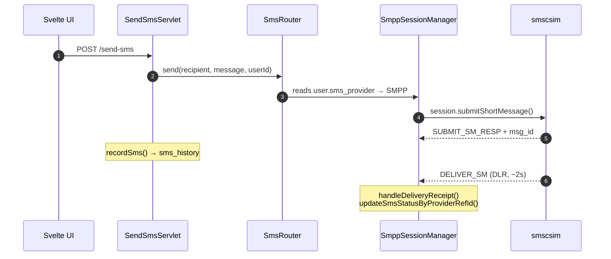
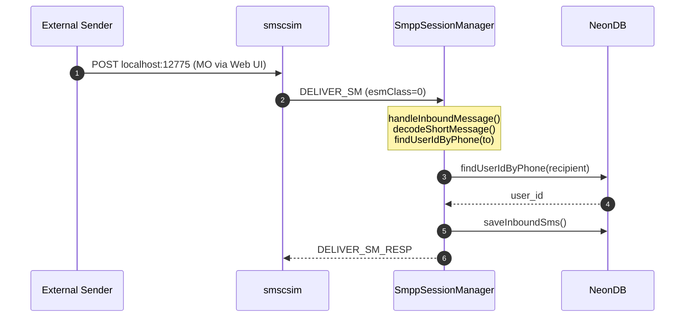
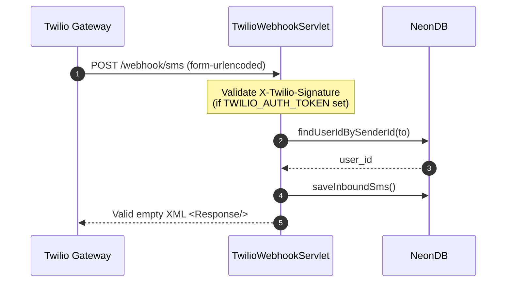

# Twilio SMS Client — Onboarding Guide

**Contents:**
[Architecture](#architecture) · [Prerequisites](#prerequisites) · [Quick Start](#quick-start) · [Running the Project (All Methods)](#running-the-project--all-methods) · [Database Migrations (Flyway)](#database-migrations-flyway) · [Key Tables](#key-tables) · [SMS Flows](#sms-flows) · [SMS Providers](#sms-providers) · [Three Chat Systems Explained](#three-chat-systems-explained) · [Admin Features](#admin-features) · [Internal Chat](#internal-chat) · [Wireshark](#wireshark--full-project-traffic-capture) · [3 Dev Workflows](#cli--podman--intellij--3-dev-workflows) · [Testing Guide](#testing-guide--all-three-chat-systems) · [Troubleshooting](#troubleshooting) · [File Map](#file-map) · [Key Classes](#key-classes--code-walkthrough) · [Auth & Session](#auth--session-flow) · [WebSocket Chat](#websocket-chat-architecture) · [Frontend Guide](#frontend-development-guide) · [How to Add a Feature](#how-to-add-a-new-feature) · [Quick Reference](#quick-reference) · [Debugging Tips](#debugging-tips)

## Architecture

```
┌─────────────────────────────────────────────────────┐
│                   Frontend (Svelte 5)               │
│  ┌──────────┐ ┌──────────┐ ┌───────────────────┐   │
│  │Customer  │ │Admin     │ │Internal Chat      │   │
│  │Dashboard │ │Console   │ │(WebSocket + REST) │   │
│  └────┬─────┘ └────┬─────┘ └────────┬──────────┘   │
│       │            │                 │              │
└───────┼────────────┼─────────────────┼──────────────┘
        │            │                 │
        ▼            ▼                 ▼
┌─────────────────────────────────────────────────────┐
│              Servlets (Jakarta EE)                   │
│  /dashboard  /admin/*  /send-sms  /ws/chat          │
│  /profile    /logout   /delete-sms  /api/chat/*     │
│  /register   /webhook/sms  /admin/smpp-logs         │
└─────────┬───────────────────────────────────┬────────┘
          │                                   │
          ▼                                   ▼
┌─────────────────┐           ┌─────────────────────────┐
│  SmsRouter      │           │  UserRepository         │
│  ↓ dispatch     │           │  (JDBC → NeonDB)        │
│  TwilioProvider │           │  Flyway migrations      │
│  SmppProvider   │           └─────────────────────────┘
│  → SMSC/smscsim │
└─────────────────┘
```

## Prerequisites

| Tool | Version | Purpose |
|------|---------|---------|
| Java | 21+ | Server runtime |
| Maven | 3.9+ | Build |
| Node | 20+ | Frontend build |
| Podman / Docker | 4+ | smscsim container |
| PostgreSQL (NeonDB) | 17 | Shared database |

## Quick Start

```bash
# 1. Clone & enter
git clone <repo>
cd Twilio-SMS-Client

# 2. Configure environment
cp .env.example .env   # edit as needed
# APP_PROFILE=local → uses LOCAL_SMPP_* vars
# APP_PROFILE=docker → uses DOCKER_SMPP_* vars

# 3. Start SMSC simulator
podman-compose up -d smscsim
# or: docker compose up -d smscsim
# Verify: curl http://localhost:12775/ → web UI

# 4. Build frontend
cd frontend && npm install && npm run build && cd ..

# 5. Start Jetty
mvn jetty:run

# 6. Open http://localhost:8080
# Login: admin / 123456
```

## Running the Project — All Methods

### A. Single Terminal (Quickest for Dev)

Best for: frontend changes, backend changes one at a time. Simple — one terminal, one `mvn jetty:run` command.

```bash
# Terminal 1: SMSC simulator
podman-compose up -d smscsim

# Same terminal: build frontend + start Jetty
cd frontend && npm install && npm run build && cd ..
mvn jetty:run
```

**What `mvn jetty:run` does:**
1. Compiles Java sources in `src/main/java/` (auto-detects changes)
2. Copies static assets from `src/main/webapp/` (including frontend build output)
3. Runs Flyway migrations to ensure DB schema is current
4. Starts embedded Jetty server on port 8080
5. Watches `target/classes/` for recompilation (auto-reloads changed servlets)

**Wait for**: `"Started Server@..."` in logs (~5-15s depending on compile). Then open `http://localhost:8080`.

**After changing `.svelte` files**: `Ctrl+C` to stop, `npm run build` + `mvn jetty:run` to restart.

### B. Multi-Terminal (Recommended)

Best for: iterating on frontend + backend simultaneously.

```bash
# Terminal 1: SMSC simulator
podman-compose up -d smscsim

# Terminal 2: Frontend dev server (hot-reload)
cd frontend
npm install
npm run dev -- --host
# → serves at http://localhost:5173, proxies /api/* /ws/* /login /dashboard to localhost:8080
# Edit any .svelte file → browser auto-reloads in <1s

# Terminal 3: Backend (Jetty)
mvn jetty:run
```

**Terminal 3 note**: `mvn jetty:run` here starts the same server as Method A, but you point your browser at `http://localhost:5173` (Vite proxy) instead of `localhost:8080`. The Vite proxy forwards all API/WebSocket requests to Jetty on `localhost:8080`, so the backend runs identically. Wireshark capture sees both the Vite proxy traffic and direct Jetty traffic (both on loopback).

When using `npm run dev`, the frontend dev server proxies all API calls to Jetty. For SMPP flows, both the regular build at `localhost:8080` and the dev server at `localhost:5173` route through the same backend so Wireshark capture, SMS sending, and SMPP logging work identically.

### C. podman-compose Full Stack (Production-like)

Best for: testing the complete deployment, verifying Dockerfile/Docker behavior, or demoing.

```bash
# 1. Build frontend (compiled assets go to src/main/webapp/)
cd frontend && npm install && npm run build && cd ..

# 2. Set profile to docker
sed -i 's/APP_PROFILE=local/APP_PROFILE=docker/' .env
# Or edit .env manually

# 3. Start everything
podman-compose --env-file .env up -d --build

# 4. Watch logs
podman-compose logs -f

# 5. Open http://localhost:8080
# Login: admin / 123456
```

This builds a Docker image of the app (`Dockerfile` in project root), starts Jetty inside a container alongside smscsim. The `APP_PROFILE=docker` setting changes SMPP host resolution from `localhost` to `smscsim` (container hostname).

To tear down:
```bash
podman-compose down
```

### D. IntelliJ IDEA (Debug Mode)

Best for: step-through debugging, breakpoints, variable inspection.

```bash
# Terminal: SMSC simulator
podman-compose up -d smscsim
```

1. Open project in IntelliJ
2. **Run → Edit Configurations → + → Maven**
3. Name: `Jetty`
4. Command line: `jetty:run`
5. Working directory: project root
6. **Run → Edit Configurations → + → npm** (optional, for frontend dev server)
7. Name: `Frontend Dev`
8. Script: `dev`
9. Working directory: `frontend/`
10. Click **Debug** on the Jetty config → breakpoints work on Java servlets, SMPP handlers, and chat WebSocket code

## Database Migrations (Flyway)

### Why Flyway?

We use [Flyway](https://flywaydb.org/) for database schema version control. Every schema change is a versioned SQL file in `src/main/resources/db/migration/`. On app startup, `DBUtil.contextInitialized()` obtains a HikariCP `DataSource`, passes it to `Flyway.configure().dataSource(ds).load()`, and calls `.migrate()`. This shares the connection pool — Flyway doesn't open its own connections.

`Flyway.migrate()`:
1. Reads the `flyway_schema_history` table in NeonDB (tracks which migrations are already applied + their checksums)
2. Scans migration files on classpath, ordered by version number
3. Compares — already-applied migrations are skipped (checksum-verified). **If a checksum doesn't match** the recorded value, Flyway throws an error and startup fails.
4. Applies any new migrations in sequence
5. Records each successful migration in `flyway_schema_history`

### Checksum Mismatch — Repair

If you accidentally edit an already-applied migration file, Flyway detects the checksum change and errors. Two options:

```
# Option A (preferred): create a new migration with the corrected SQL
# Option B (quick fix): delete the bad checksum record, let Flyway re-apply
DELETE FROM flyway_schema_history WHERE version=N;
```

Then restart Jetty. Option B is useful during development but never do it on a shared DB — you'll desync other devs.

### When to Create a Migration

Any DB schema change — new table, new column, new enum — gets a new migration file. **All migrations must be additive only**: `ADD COLUMN IF NOT EXISTS`, `CREATE TABLE IF NOT EXISTS`. No destructive operations (DROP, ALTER without IF EXISTS). This keeps every dev instance in sync regardless of which migrations are already applied.

### Our Migration History

| File | Purpose |
|-----------|---------|
| V1__database.sql | Initial schema (users, sms_history, message_status) |
| V2__user_role.sql | user_role enum + role column |
| V3__sms_provider.sql | sms_provider + SMPP columns on users |
| V4__internal_messages.sql | Internal chat table |
| V5__system_message_reads.sql | Broadcast read tracking |
| V6__add_smpp_event_logs.sql | smpp_event_logs table (persistent SMPP debug events) |

### How to Create a New Migration

```bash
# Pick next number, write SQL, place in db/migration/
echo "ALTER TABLE users ADD COLUMN IF NOT EXISTS new_column VARCHAR(50);" \
  > src/main/resources/db/migration/V7__add_new_column.sql

# Restart Jetty — Flyway applies it automatically
mvn jetty:run
```

### Schema Safety Rules

- Never edit an applied migration file — Flyway detects checksum mismatch and errors on startup
- Make a new migration file instead
- Always use `IF NOT EXISTS` / `IF EXISTS` for ALTER
- Test locally first: drop your `flyway_schema_history` rows for the new migration, restart, verify

## Key Tables

**`users`** — Core user accounts
| Column | Type | Notes |
|--------|------|-------|
| id | SERIAL PK | |
| username | VARCHAR(50) UNIQUE | |
| password_hash | VARCHAR(255) | BCrypt |
| role | user_role ENUM | 'customer' or 'administrator' |
| msisdn | VARCHAR(20) | Phone number, used for MO routing |
| sms_provider | VARCHAR(10) | TWILIO / SMPP / AUTO |
| smpp_host / smpp_port / smpp_system_id / smpp_password / smpp_address_range | Various | Per-user SMPP override |
| twilio_account_sid / twilio_auth_token / twilio_sender_id | VARCHAR | Per-user Twilio override |

**`sms_history`** — All SMS records
| Column | Type | Notes |
|--------|------|-------|
| id | SERIAL PK | |
| user_id | INT FK→users | Owner |
| direction | sms_direction ENUM | 'outbound' or 'inbound' |
| from_phone / to_phone | VARCHAR | |
| message | TEXT | |
| status | message_status ENUM | 'delivered', 'failed', 'pending' |
| provider_ref_id | VARCHAR | SMPP message_id for DLR matching |
| sent_at | TIMESTAMP | Auto-set |

**`internal_messages`** — Real-time chat between users
**`system_messages`** / **`system_message_reads`** — Broadcast system


## SMS Flows

### Outbound (MT)



### Inbound (MO) via SMPP



### Inbound via Twilio Webhook



## SMS Providers

### Per-User Routing

Each user has an `sms_provider` column:
- `TWILIO` — always uses Twilio API (requires valid credentials)
- `SMPP` — always uses SMPP via smscsim (or real SMSC in production)
- `AUTO` — tries SMPP first; if it fails, falls back to Twilio

Provider config is resolved in order:
1. User-specific DB columns (`smpp_host`, `smpp_port`, etc.)
2. Environment variables (`LOCAL_SMPP_*` or `DOCKER_SMPP_*` based on `APP_PROFILE`)
3. Defaults (localhost:2776)

### smscsim (Local SMSC Simulator)

**Image**: `localhost/smscsim-fixed` (custom build, not upstream)
**Base**: ukarim/smscsim with one fix — empty `service_type` in DELIVER_SM PDU (upstream sets "smscsim" which exceeds SMPP 5-char limit, causing jsmpp to reject it).

**Build locally** (if upstream changes):
```bash
git clone https://github.com/ukarim/smscsim.git /tmp/smscsim
cd /tmp/smscsim
# Edit smsc.go: set service_type to "" in deliverSmPDU
CGO_ENABLED=0 go build -o smscsim .
podman build -t localhost/smscsim-fixed .
```

**Ports**:
| Port | Use |
|------|-----|
| 2776 | SMPP (host) → 2775 (container) |
| 12775 | Web UI for MO injection |

**Inject MO via web UI**:
```bash
curl -X POST http://localhost:12775/ \
  -d "sender=+15551234567" \
  -d "recipient=+201090702972" \
  -d "message=test" \
  -d "system_id=smppclient"
```

**DLR**: Automatically sent ~2s after SUBMIT_SM when `registered_delivery` flag is set.

## Three Chat Systems Explained

The app has three separate messaging systems. Each uses a different transport and serves a different purpose.

### 1. SMS Chat (Customer Dashboard — SMS tab)

**Transport**: Twilio REST API (`Message.creator().create()`) or SMPP (`SmppSessionManager.submit()`)

**How it works**:
```
User types message → POST /send-sms → SmsRouter.send(to, message, userId)
  → reads user's sms_provider column (TWILIO | SMPP | AUTO)
  → TWILIO: TwilioSmsProvider → Message.creator(from, to, body).create()
  → SMPP: SmppSessionManager.submit() → BIND_TRX pool → SUBMIT_SM
  → records in sms_history with status (delivered|pending) + provider_ref_id
  → SMPP DLR (~2s): DELIVER_SM(esmClass=4) → DeliveryReceipt → UPDATE status
Dashboard: polls GET /dashboard every 5s → outboundHistory + inboundHistory
```

**What it's for**: Sending real SMS messages to external phone numbers. Each message costs $0.0079 (Twilio) or free (SMPP simulator). Status tracking via DLR (SMPP) or synchronous response (Twilio).

**Role access**: Any authenticated user. Admin has no SMS chat UI in AdminDashboard — must navigate to `/chat` URL. `POST /send-sms` has servlet-level session check (no AuthFilter).

**Admin behavior**: Admin CAN send SMS via `/chat` URL, but AdminDashboard has no SMS tab. This is a design gap — admin SMS sending is not exposed in the admin UI.

**Difference Twilio vs SMPP**:

| Aspect | Twilio | SMPP |
|--------|--------|------|
| API | REST `Message.creator()` | JSMPP binary protocol |
| Auth | Per-user SID + token in DB | BIND_TRX with system_id/password |
| Status | Synchronous (response includes SID) | Async DLR (DELIVER_SM ~2s later) |
| Cost | $0.0079/SMS | Free (simulator) or operator contract |
| Setup | Real account required | Local smscsim Docker container |
| Dev mode | Requires real creds or mock | Zero config with smscsim |

### 2. Internal Chat (Customer Dashboard — Internal tab)

**Transport**: WebSocket (`/ws/chat`, JSR 356) + REST fallback (`/api/chat/*`)

**How it works**:
```
CustomerDashboard renders InternalChat.svelte → opens WebSocket /ws/chat
User selects recipient from list → types message → POST /api/chat/send
  → ChatServlet validates session, prevents self-message
  → UserRepository.insertInternalMessage(senderId, recipientId, content)
  → ChatWebSocket.pushToUser(recipientId, {type:"new_message", data})
    → recipient's InternalChat.svelte reloads history if activeUserId matches
  → If recipient has no WS open: message waits in DB
    → unread badge appears on Internal tab (polled every 10s via /api/chat/unread)
    → when recipient opens Internal tab + selects sender → history loads → read_at set
```

**What it's for**: Real-time user-to-user messaging within the app. Zero cost. No external carriers.

**Role access**: Any authenticated user. **Admin users are now excluded from customer user lists** (so customers can't message admin and vice versa). Admin has no InternalChat UI in AdminDashboard — must navigate to `/chat` URL.

**Real-time vs polling**:
- Real-time WebSocket push ONLY works when recipient has Internal tab open (component mounted, WS connected)
- Otherwise: unread badge polling every 10s is the notification mechanism
- When user opens Internal tab and selects a conversation, full history loads from DB

**Read tracking**: `read_at` column on `internal_messages` set when messages are loaded in history. Separate `system_message_reads` upsert for broadcast messages.

### 3. System Messages (Customer Dashboard — System tab / Admin Dashboard)

**Transport**: HTTP POST + WebSocket push

**How it works**:
```
Admin writes broadcast → POST /admin/broadcast {content, sendSms}
  → Requires administrator role (403 if customer tries)
  → INSERT INTO system_messages → msgId
  → pushToUser per customer userId (WebSocket real-time)
  → Optional: SmsRouter.send() as real SMS per each user's configured provider

Customer sees:
  → SystemConversation.svelte mounts → GET /api/chat/system?limit=100
  → Messages displayed chronologically with read/unread indicator
  → Read tracking: markSystemRead(userId, lastReadId) upsert
  → Unread badge on System tab (10s poll via /api/chat/unread)

Admin sees:
  → AdminDashboard broadcasts section → GET /api/chat/system?limit=100 (30s refresh)
  → Scrollable list of past broadcasts with timestamps
```

**What it's for**: One-to-many announcements from admin to all customers. Optional SMS delivery for urgent notifications.

**Role access**: Write = admin only. Read = any authenticated user. Admin sees history in AdminDashboard. Customer sees in System tab.

### Comparison Table

| Aspect | SMS Chat | Internal Chat | System Messages |
|--------|----------|---------------|-----------------|
| **Transport** | Twilio REST or SMPP binary | WebSocket + REST HTTP | HTTP + WebSocket push |
| **Real-time** | 5s polling | WS push (when tab open) | WS push on send |
| **Delivery guarantee** | DLR callback (SMPP) / sync response (Twilio) | DB + best-effort WS | DB + best-effort WS |
| **Who can send** | Any user | Any user | Admin only |
| **Who can receive** | External phone number | Another app user | All customers |
| **Cost** | $0.0079/sms (Twilio) / free (SMPP) | Free | Free (SMS optional at cost) |
| **Status tracking** | pending → delivered/failed | read_at timestamp | last_read_id (read/unread) |
| **Sender UI** | CustomerDashboard SMS tab | CustomerDashboard Internal tab | AdminDashboard Broadcast modal |
| **Recipient UI** | External SMS app | CustomerDashboard Internal tab | CustomerDashboard System tab |
| **Admin access** | Via `/chat` URL only (no UI in admin dashboard) | Via `/chat` URL only | Full UI in AdminDashboard |
| **Role check** | Session only | Session only | Write: admin. Read: any auth |

## Admin Features

### Broadcast
- `POST /admin/broadcast` with JSON `{content, sendSms}`
- Sends internal chat message to all users via WebSocket
- Optionally sends as real SMS via each user's configured provider

### SMPP Logs (Admin Debug Panel)
- `GET /admin/smpp-logs` — returns last 500 SMPP events from `smpp_event_logs` table
- Events: BIND, SUBMIT, DLR, MO, ERROR
- Persists across server restarts (DB-backed, not in-memory)
- Auto-refreshes every 3s in admin dashboard
- Click "SMPP Logs" button in header to open modal

### Wireshark Integration (Admin Dashboard)
- **Start Capture** → runs `dumpcap` via `sg wireshark -c` on a background thread
- **Stop Capture** → kills the dumpcap process
- **Status** → polls `GET /admin/wireshark/status` every 2s (running / stopped + packet count)
- **Live Packet Table** → auto-updates with decoded packets via `tshark -T json`
- **Download PCAP** → `GET /admin/wireshark/download` serves the raw capture file
- **Captures all project traffic**: HTTP (8080), SMPP (2776), smscsim UI (12775), Vite dev (5173)
- **Protocol column**: Color-coded badge (purple=SMPP, blue=HTTP/TCP). SMPP commands decoded by name (SUBMIT_SM, DELIVER_SM, etc). HTTP shows method (GET/POST) + URI or status code.

Backend: `WiresharkServlet.java` handles all endpoints. Capture file lives at `/tmp/smpp_capture.pcap`. Frontend button in AdminDashboard header → modal with start/stop, live table, PCAP download.

### Customer CRUD
- View all customers, SMS counts
- Create / Edit / Delete customer accounts
- View per-customer SMS history (inbound + outbound)

## Internal Chat

- **WebSocket**: `/ws/chat` (JSR 356). Authenticated via HTTP session in handshake (`ChatConfigurator`). Per-user `ConcurrentHashMap<Integer, Set<Session>>` for targeted push via `ChatWebSocket.pushToUser(userId, json)`. Auto-reconnect on disconnect (3s delay).
- **REST API**: `POST /api/chat/send`, `GET /api/chat/history?with=X&before=Y&limit=Z`, `GET /api/chat/users`, `GET /api/chat/unread`, `GET /api/chat/system`
- **Real-time delivery**: Only when recipient has Internal tab open (WebSocket connected). Otherwise, messages appear on next history load.
- **Unread badges**: Counts polled every 10s via `/api/chat/unread`. Red badge on Internal tab (99+ cap). Separate count for system messages.
- **Read tracking**: `read_at` column on `internal_messages` (set on history load). `last_read_id` upsert on `system_message_reads` (ON CONFLICT).
- **Self-message guard**: Server rejects `recipientId == userId` with 400.
- **System broadcasts**: `POST /admin/broadcast` → `system_messages` insert → WebSocket push to all connected customers → optional real SMS via each user's provider.

## Wireshark — Full Project Traffic Capture

The admin dashboard includes a **Wireshark Capture** button that starts/stops packet capture directly from the browser. Backend uses `dumpcap` (Wireshark's CLI capture tool) wrapped via `sg wireshark -c` for group permissions. No need to SSH or run tcpdump manually.

Captures **all project traffic**, not just SMPP. BPF filter: `port 8080 or port 2776 or port 12775 or port 5173`. This covers:
- **port 8080** — Jetty; all HTTP API calls + WebSocket (internal chat, dashboard, login, SMS send, broadcast)
- **port 2776** — SMPP; SUBMIT_SM, DELIVER_SM, DLR, BIND, ENQUIRE_LINK
- **port 12775** — smscsim web UI (HTTP)
- **port 5173** — Vite dev server (when using hot-reload workflow)

### Installation

```bash
# CachyOS / Arch
sudo pacman -S wireshark-qt

# Add user to wireshark group for non-root capture
sudo usermod -aG wireshark $USER
# Log out and back in, or run: newgrp wireshark
```

### Capture SMPP Traffic

Since smscsim runs on localhost:2776, capture on the loopback interface:

```bash
# Option A: Start Wireshark GUI (recommended)
sudo wireshark &

# Option B: Capture to file then open
sudo tcpdump -i lo -w /tmp/smpp.pcap port 2776
# ...send some SMSes, then Ctrl+C
wireshark /tmp/smpp.pcap
```

### Filter Packets

Once in Wireshark:

| Filter | What it shows |
|--------|---------------|
| `tcp.port == 2776` | All SMPP traffic (TCP-level) |
| `smpp` | SMPP protocol packets only (requires SMPP dissector) |
| `smpp.command == 0x00000004` | Only SUBMIT_SM (outbound) |
| `smpp.command == 0x80000004` | Only SUBMIT_SM_RESP (ack) |
| `smpp.command == 0x00000005` | Only DELIVER_SM (inbound) |
| `smpp.command == 0x80000005` | Only DELIVER_SM_RESP |
| `smpp.command == 0x00000009` | Only BIND_TRX |
| `smpp.command == 0x80000009` | Only BIND_TRX_RESP |

### Steps for a Full Trace

1. Start Wireshark capture on `lo`, filter `port 2776`
2. Send an SMS from the app (`send-sms` POST)
3. Wait for DLR (~2s)
4. Inject MO via smscsim web UI
5. Stop capture
6. In Wireshark: right-click a packet → Follow → TCP Stream

You'll see the raw SMPP PDU hex for every exchange:
- `BIND_TRX` → `BIND_TRX_RESP` (session establishment)
- `SUBMIT_SM` → `SUBMIT_SM_RESP` (outbound SMS + message_id)
- `DELIVER_SM` → `DELIVER_SM_RESP` (DLR or MO)
- `ENQUIRE_LINK` → `ENQUIRE_LINK_RESP` (keepalive every 30s)

### Troubleshooting

**No SMPP dissector?** Wireshark auto-detects SMPP on port 2776. If not, force it: right-click a TCP packet → Decode As → Transport → SMPP.

**Permission denied?** Ensure user is in `wireshark` group or run as sudo.

**Only TCP packets, no SMPP?** The SMPP session must be established (bound) before any SMPP PDUs flow. If capture starts mid-session, rebind by sending an SMS.

## CLI / Podman / IntelliJ — 3 Dev Workflows

### 1. CLI (Fastest)

```bash
# Terminal 1: SMSC
podman-compose up -d smscsim

# Terminal 2: Build + run
cd frontend && npm run build && cd ..
mvn jetty:run
```

### 2. Podman (All-in-one)

```bash
podman-compose --env-file .env up -d
# Set APP_PROFILE=docker in .env for container networking
```

### 3. IntelliJ IDEA

1. Open project root
2. Run smscsim via Services panel (Docker connection, `docker-compose.yml`)
3. Run `mvn jetty:run` in terminal
4. Open built-in browser at localhost:8080

## Testing Guide — All Three Chat Systems

### Prerequisites
```bash
# Start SMPP stack
podman-compose up -d smscsim

# Start app
cd frontend && npm run build && cd .. && mvn jetty:run
```

### Test 1: SMS Chat (SMPP)

```bash
# 1. Login as user (provider=AUTO → SMPP)
curl -X POST http://localhost:8080/login \
  -H "Content-Type: application/json" \
  -d '{"username":"zkhattab","password":"kh007"}' -c cookies_user.txt

# 2. Send SMS via SMPP
curl -X POST http://localhost:8080/send-sms \
  -H "Content-Type: application/json" \
  -b cookies_user.txt \
  -d '{"recipient":"+15550000001","message":"Hello via SMPP"}'
# Expected: {"status":"success","provider":"SmppSmsProvider","messageId":"..."}

# 3. Wait 2-3s for DLR, then check delivery status
curl -b cookies_user.txt http://localhost:8080/dashboard | python3 -c "
import sys,json
d=json.load(sys.stdin)
for m in d.get('outboundHistory',[]):
  print('STATUS:', m['status'], 'MSG:', m['message'])
"
# Expected: STATUS: delivered MSG: Hello via SMPP

# 4. Inject MO (simulates external sender)
curl -X POST http://localhost:12775/ -d "sender=+15551111111" \
  -d "recipient=+201090702972" \
  -d "message=MO reply" \
  -d "system_id=smppclient"

# 5. Verify MO in dashboard
curl -b cookies_user.txt http://localhost:8080/dashboard | python3 -c "
import sys,json
d=json.load(sys.stdin)
for m in d.get('inboundHistory',[]):
  print('FROM:', m['from'], 'MSG:', m['message'])
"
# Expected: FROM: +15551111111 MSG: MO reply

# 6. Role check: admin can also send SMS (via /chat URL, not AdminDashboard)
curl -X POST http://localhost:8080/login \
  -H "Content-Type: application/json" \
  -d '{"username":"admin","password":"123456"}' -c cookies_admin.txt
curl -X POST http://localhost:8080/send-sms \
  -H "Content-Type: application/json" \
  -b cookies_admin.txt \
  -d '{"recipient":"+15550000002","message":"Admin SMS test"}'
# Expected: success (admin has session, no AuthFilter guard on /send-sms)

# 7. Verify SMPP event logs
curl -b cookies_admin.txt http://localhost:8080/admin/smpp-logs | python3 -c "
import sys,json
d=json.load(sys.stdin)
print(d[:3] if isinstance(d,list) else d)
"
# Expected: list of SMPP events with timestamps, types (BIND, SUBMIT, DLR, MO)
```

### Test 2: Internal Chat (WebSocket + REST)

```bash
# You need TWO user sessions for this test

# Terminal A: Login as user1 (zkhattab)
curl -X POST http://localhost:8080/login \
  -H "Content-Type: application/json" \
  -d '{"username":"zkhattab","password":"kh007"}' -c cookies_u1.txt

# Terminal B: Login as user2 (register a 2nd user first via UI, or use any other)
curl -X POST http://localhost:8080/login \
  -H "Content-Type: application/json" \
  -d '{"username":"user2","password":"pass2"}' -c cookies_u2.txt

# Terminal A: Send internal chat message
curl -X POST http://localhost:8080/api/chat/send \
  -H "Content-Type: application/json" \
  -b cookies_u1.txt \
  -d '{"recipientId":2,"content":"Hello from user1"}'
# Expected: {"status":"success","messageId":N}

# Terminal A: Get conversation history with user2
curl -b cookies_u1.txt 'http://localhost:8080/api/chat/history?otherUserId=2&limit=20'
# Expected: JSON array with the message, read_at=null

# Terminal B: Mark as read (load history)
curl -b cookies_u2.txt 'http://localhost:8080/api/chat/history?otherUserId=1&limit=20'
# Expected: JSON array, read_at is now set (non-null timestamp)

# Terminal B: Check unread count
curl -b cookies_u2.txt http://localhost:8080/api/chat/unread
# Expected: {"unreadCount":1} — or 0 if already marked read

# Terminal B: Reply
curl -X POST http://localhost:8080/api/chat/send \
  -H "Content-Type: application/json" \
  -b cookies_u2.txt \
  -d '{"recipientId":1,"content":"Reply from user2"}'

# Terminal A: Check for new message in history
curl -b cookies_u1.txt 'http://localhost:8080/api/chat/history?otherUserId=2&limit=20'
# Expected: both messages, ordered by sent_at ascending

# Edge case: self-message should fail
curl -X POST http://localhost:8080/api/chat/send \
  -H "Content-Type: application/json" \
  -b cookies_u1.txt \
  -d '{"recipientId":1,"content":"To myself"}'
# Expected: {"status":"error","message":"Cannot send message to yourself"} or 400

# Edge case: admin is not in user list (customers can't see admin)
curl -b cookies_u1.txt http://localhost:8080/api/chat/users
# Expected: admin user (id=1) NOT in the returned list

# Edge case: unauthenticated user
curl http://localhost:8080/api/chat/users
# Expected: 302 redirect to login or 403
```

### Test 3: System Messages (Broadcast)

```bash
# 1. Login as admin
curl -X POST http://localhost:8080/login \
  -H "Content-Type: application/json" \
  -d '{"username":"admin","password":"123456"}' -c cookies_admin.txt

# 2. Send broadcast (internal only, no SMS)
curl -X POST http://localhost:8080/admin/broadcast \
  -H "Content-Type: application/json" \
  -b cookies_admin.txt \
  -d '{"content":"System maintenance tonight at 2am","sendSms":false}'
# Expected: {"status":"success","message":"Broadcast sent"}

# 3. Send broadcast with SMS fallback
curl -X POST http://localhost:8080/admin/broadcast \
  -H "Content-Type: application/json" \
  -b cookies_admin.txt \
  -d '{"content":"URGENT: Update your profile","sendSms":true}'
# Expected: success. SMS will be sent per user via their configured provider

# 4. Login as user and read system messages
curl -X POST http://localhost:8080/login \
  -H "Content-Type: application/json" \
  -d '{"username":"zkhattab","password":"kh007"}' -c cookies_u1.txt
curl -b cookies_u1.txt 'http://localhost:8080/api/chat/system?limit=50'
# Expected: JSON array with both broadcasts

# 5. Mark as read
curl -X POST http://localhost:8080/api/chat/system/read \
  -H "Content-Type: application/json" \
  -b cookies_u1.txt \
  -d '{"lastReadId":2}'
# Expected: {"status":"success"}

# 6. Verify unread is now 0 for system
curl -b cookies_u1.txt http://localhost:8080/api/chat/unread
# Expected: {"unreadCount":0} (system unread cleared)

# 7. Role check: customer cannot send broadcast
curl -X POST http://localhost:8080/admin/broadcast \
  -H "Content-Type: application/json" \
  -b cookies_u1.txt \
  -d '{"content":"Hack the planet","sendSms":false}'
# Expected: 403 Forbidden or {"error":"Access denied"}
```

### Test 4: Wireshark Capture (Admin Only)

```bash
# User must be in wireshark group
groups  # verify 'wireshark' appears

# Login as admin
curl -X POST http://localhost:8080/login \
  -H "Content-Type: application/json" \
  -d '{"username":"admin","password":"123456"}' -c cookies_admin.txt

# Start capture
curl -X POST -b cookies_admin.txt http://localhost:8080/admin/wireshark/start
# Expected: {"status":"started","captureId":"...","interface":"loopback"}

# Check status
curl -b cookies_admin.txt http://localhost:8080/admin/wireshark/status
# Expected: {"running":true,"packetCount":0,"durationSec":N,"fileSize":0}

# Send some SMS/SMPP traffic (creates packets)
curl -X POST http://localhost:8080/send-sms \
  -H "Content-Type: application/json" \
  -b cookies_admin.txt \
  -d '{"recipient":"+15550000003","message":"Wireshark test"}'

# Wait 2s, check status again
curl -b cookies_admin.txt http://localhost:8080/admin/wireshark/status
# Expected: packetCount > 0

# Stop capture
curl -X POST -b cookies_admin.txt http://localhost:8080/admin/wireshark/stop
# Expected: {"status":"stopped","packetCount":N,"durationSec":N}

# Get packets
curl -b cookies_admin.txt http://localhost:8080/admin/wireshark/packets
# Expected: JSON array of parsed packets

# Download PCAP
curl -b cookies_admin.txt http://localhost:8080/admin/wireshark/download -o /tmp/capture.pcap
# Expected: binary PCAP file, openable with Wireshark: wireshark /tmp/capture.pcap
```

### Test 5: Provider Routing (Twilio vs SMPP)

```bash
# Login as user with SMPP provider
curl -X POST http://localhost:8080/login \
  -H "Content-Type: application/json" \
  -d '{"username":"zkhattab","password":"kh007"}' -c cookies_smpp.txt

# Send SMS — should route via SMPP
curl -X POST http://localhost:8080/send-sms \
  -H "Content-Type: application/json" \
  -b cookies_smpp.txt \
  -d '{"recipient":"+15550000004","message":"SMPP route test"}'
# Expected: provider field in response is "SmppSmsProvider"

# Login as user with TWILIO provider (will fail gracefully without real creds)
curl -X POST http://localhost:8080/login \
  -H "Content-Type: application/json" \
  -d '{"username":"twilio_user","password":"..."}' -c cookies_twilio.txt

# If user's sms_provider=TWILIO with fake creds:
curl -X POST http://localhost:8080/send-sms \
  -H "Content-Type: application/json" \
  -b cookies_twilio.txt \
  -d '{"recipient":"+15550000005","message":"Twilio test"}'
# Expected: error like "Gateway execution error" or "Authentication failed"
```

## Troubleshooting

| Symptom | Cause | Fix |
|---------|-------|-----|
| SLF4J NOP logging | Jetty classloader isolates webapp from log binding | Use `slf4j-simple` (not logback-classic) |
| MO not appearing in DB | User's `msisdn` is NULL in `users` table | `UPDATE users SET msisdn='...' WHERE id=?` |
| Webhook returns 404 | User has no `twilio_sender_id` or matching `msisdn` | Set one of them in user profile |
| Cannot bind to SMSC | smscsim container not running | `podman restart smscsim-fixed` |
| "Failed to load class StaticLoggerBinder" | Jetty Maven Plugin classpath | Switch to `slf4j-simple` in pom.xml |
| SMS sends but DLR never arrives | smscsim not running or wrong port | Check `podman ps`, verify port 2776 |
| Profile update wipes fields | Old code unconditionally SET all columns | Fixed: now uses `containsKey` check |

## File Map

```
src/main/java/com/twilio/twilio_project/
├── SmppSessionManager.java    — SMPP session pool, bind/send/DLR/MO
├── SmpEventLogger.java        — SMPP event DB logger (smpp_event_logs table)
├── SmsRouter.java             — Per-user provider dispatch
├── TwilioSmsProvider.java     — Twilio API wrapper
├── SmppSmsProvider.java       — SMPP provider wrapper
├── TwilioWebhookServlet.java  — Inbound SMS via Twilio callback
├── SendSmsServlet.java        — POST /send-sms
├── AdminLogServlet.java       — GET /admin/smpp-logs (persistent)
├── AdminDashboardServlet.java — GET /admin/dashboard
├── WiresharkServlet.java      — POST/GET /admin/wireshark/* (packet capture)
├── BroadcastServlet.java      — POST /admin/broadcast
├── ChatWebSocket.java         — WS /ws/chat
├── UserRepository.java        — All JDBC queries
├── SpaFilter.java             — SPA routing fallback
├── AuthFilter.java            — Session auth guard
├── LogoutServlet.java         — GET /logout
└── PhoneUtil.java             — Phone normalization

frontend/src/lib/
├── AdminDashboard.svelte      — Admin console (customers, broadcast, SMPP logs)
├── CustomerDashboard.svelte   — User dashboard (SMS, internal chat, system)
├── AdminCustomerView.svelte   — Customer create/edit modal
├── InternalChat.svelte        — Real-time user-to-user chat
└── SystemConversation.svelte  — Broadcast system messages

## Key Classes — Code Walkthrough

### SmppSessionManager.java

Central SMPP session pool. Key pattern:

```
BIND_TRX → stores session in ConcurrentHashMap<PoolKey, Session>
send() → pool.get(key).submitShortMessage()
DLR → MessageReceiverListener.onAcceptDeliverSm() checks esmClass==4
MO → same listener, esmClass==0
```

Pool key = `host:port:systemId`. Sessions auto-reconnect via `ENQUIRE_LINK` every 30s (jsmpp default). Every operation calls `SmpEventLogger.log()` for the admin debug panel.

### SmsRouter.java

Simple dispatch — no interface, no factory. Reads user's `sms_provider` from `UserRepository`, routes:
- `TWILIO` → `TwilioSmsProvider.send()`
- `SMPP` → `SmppSmsProvider.send()` → `SmppSessionManager.submit()`
- `AUTO` → try SMPP, catch → Twilio fallback

### UserRepository.java

Single DAO class, all `Connection` obtained from `DBUtil.getConnection()` (HikariCP pool). Key methods:
- `findUserIdByPhone()` — used by MO routing, matches `users.msisdn`
- `getAllUsers()`/`getUserById()` — admin customer list
- `updateUserProfile()` — uses `containsKey` to avoid wiping unset fields to NULL
- `recordSms()`/`saveInboundSms()` — insert into `sms_history`
- `updateSmsStatusByProviderRefId()` — DLR status update

### DBUtil.java

Singleton: HikariCP config → `DataSource` → `Flyway.migrate()`. Profile-based env resolution via `EnvLoader`. Called once in `contextInitialized()`.

### SpaFilter.java

Intercepts all requests to `/`. If path is a known API prefix (`/api/`, `/admin/smpp-logs`, `/admin/wireshark/`, `/ws/`, etc.) → pass through. Else → forward to `index.html` (Svelte SPA handles client-side routing).

## Auth & Session Flow

```
POST /login (username, password)
  → LoginServlet: BCrypt.checkpw(hash, input)
  → req.getSession().setAttribute("user", userId)
  → AuthFilter: checks session on every /* request
  → role check for /admin/* (must be administrator)
  → LogoutServlet: session.invalidate()
```

`AuthFilter` is a `Filter` mapped to `/*`. Skips static assets and public endpoints (`/login`, `/register`, `/verify-msisdn`, `/webhook/sms`).

## WebSocket Chat Architecture

```
Client JS (InternalChat.svelte)
 → new WebSocket("ws://host/ws/chat")
 → ChatWebSocket.ChatConfigurator: extracts userId from HTTP session during handshake
 → onOpen: registers session in userSessions[userId] (ConcurrentHashMap<Integer, Set<Session>>)
 → onClose/onError: removes session from map, cleans up empty entries
 → Server push via ChatWebSocket.pushToUser(recipientId, json):
   - Looks up recipient's sessions in userSessions map
   - Iterates, sends JSON via session.getBasicRemote().sendText()
   - Silently skips closed sessions
 → REST fallback: POST /api/chat/send → UserRepository.insertInternalMessage() → pushToUser
 → Broadcast: POST /admin/broadcast → system_messages insert → pushToUser per customer
```

**Key points**:
- Sessions tracked per-user (`ConcurrentHashMap<Integer, Set<Session>>`), not global Set. Enables targeted delivery without iterating all sessions.
- No external message broker — direct in-process push.
- Real-time delivery requires recipient's WebSocket to be open (Internal tab active). Otherwise, messages are delivered on next history load.
- Unread counts polled every 10s as fallback for offline recipients.
- Admin broadcast pushes to every customer userId individually via `pushToUser`, grouped by target role.

## Frontend Development Guide

```bash
cd frontend
npm install
npm run dev          # Vite dev server on :5173, hot-reload
npm run build        # Production build → ../src/main/webapp/
```

**Vite config**: `vite.config.js` sets `outDir: '../src/main/webapp'` and `base: '/'`. Jetty serves the compiled SPA from `webapp/`.

**Component tree**:
- `App.svelte` — SPA router (login, register, verify, customer-dashboard, admin-dashboard)
- `CustomerDashboard.svelte` — SMS chat, internal chat, system messages tabs with unread badges
- `AdminDashboard.svelte` — customers table, broadcast form, SMPP logs modal, Wireshark modal
- `AdminCustomerView.svelte` — create/edit customer profile modal
- `InternalChat.svelte` — WebSocket connection, user list, message history, send form
- `SystemConversation.svelte` — broadcast/announcement display with read status
- `LoginView.svelte` / `RegisterView.svelte` / `VerifyMsisdnView.svelte` — auth flow

**Adding a new page**: create component in `src/lib/`, add route in `App.svelte`, add API endpoint in Java.

## How to Add a New Feature

1. **DB schema change?** Create `V{next}__description.sql` in `src/main/resources/db/migration/` (additive only)
2. **Backend endpoint?** Create servlet extending `HttpServlet`, annotate with `@WebServlet("/path")`
3. **Frontend UI?** Create Svelte component in `frontend/src/lib/`, add to SPA router in `App.svelte`
4. **Admin-only?** Add path to `AuthFilter` role check
5. **API passthrough?** Add path to `SpaFilter` passthrough list if it's a JSON endpoint under `/`
6. **Frontend build**: `cd frontend && npm run build`
7. **Restart**: `mvn jetty:run`

## Quick Reference

| Resource | Value |
|----------|-------|
| App URL | `http://localhost:8080` |
| SMPP port (host) | `2776` → container `2775` |
| smscsim Web UI | `http://localhost:12775` |
| Vite dev server | `http://localhost:5173` |
| JSMPP lib | `3.0.2` (strict C-Octet String length enforcement) |
| Flyway migrations dir | `src/main/resources/db/migration/` |
| .env profile flag | `APP_PROFILE=local` or `docker` |
| Admin login | `admin` / `123456` |
| User login | `zkhattab` / `kh007` |
| Wireshark capture file | `/tmp/smpp_capture.pcap` |
| SMPP log endpoint | `GET /admin/smpp-logs` (JSON, last 500) |
| SMS send | `POST /send-sms` `{recipient, message}` |
| SMS dashboard | `GET /dashboard` (JSON with outboundHistory + inboundHistory) |
| Internal chat send | `POST /api/chat/send` `{recipientId, content}` |
| Internal chat history | `GET /api/chat/history?otherUserId=N&limit=20` |
| Internal chat users | `GET /api/chat/users` (excludes admin for customers) |
| Unread count | `GET /api/chat/unread` (badge polling) |
| System broadcast | `POST /admin/broadcast` `{content, sendSms}` |
| System messages read | `GET /api/chat/system?limit=N` |
| System mark read | `POST /api/chat/system/read` `{lastReadId}` |

## End-to-End Test Walkthrough

```bash
# 1. Ensure smscsim is running
podman-compose up -d smscsim
curl -s http://localhost:12775/ | head -1
# Expected: HTML page (Web UI) or "ok"

# 2. Start Jetty
mvn jetty:run
# Wait for: "oejs.Server:main: Started"

# 3. Login as admin, verify dashboard
curl -s -X POST http://localhost:8080/login \
  -H "Content-Type: application/json" \
  -d '{"username":"admin","password":"123456"}' -c /tmp/cookies.txt
# Expected: {"status":"success","role":"administrator"}

# 4. Check SMPP session bound (logs)
curl -b /tmp/cookies.txt http://localhost:8080/admin/smpp-logs | python3 -m json.tool
# Expected: entries with event=BIND, level=INFO

# 5. Login as user
curl -s -X POST http://localhost:8080/login \
  -H "Content-Type: application/json" \
  -d '{"username":"zkhattab","password":"kh007"}' -c /tmp/cookies2.txt

# 6. Send outbound SMS (MT)
curl -s -X POST http://localhost:8080/send-sms \
  -H "Content-Type: application/json" \
  -b /tmp/cookies2.txt \
  -d '{"recipient":"+15551234567","message":"Hello world"}'
# Expected: {"status":"success","message":"Message sent","status":"pending"}

# 7. Wait 3s for DLR, then check status
curl -b /tmp/cookies2.txt http://localhost:8080/dashboard | python3 -c "
import sys,json
d=json.load(sys.stdin)
for m in d.get('outboundHistory',[]):
  print(m['status'], m['message'])
"
# Expected: "delivered Hello world"

# 8. Inject MO via smscsim
curl -X POST http://localhost:12775/ \
  -d "sender=+15559876543" \
  -d "recipient=+201090702972" \
  -d "message=Inbound test" \
  -d "system_id=smppclient"

# 9. Verify MO appears in dashboard
curl -b /tmp/cookies2.txt http://localhost:8080/dashboard | python3 -c "
import sys,json
d=json.load(sys.stdin)
for m in d.get('inboundHistory',[]):
  print(m['from'], m['message'])
"
# Expected: "+15559876543 Inbound test"
```

## Debugging Tips

| Situation | Command |
|-----------|---------|
| Kill Jetty without killing Firefox | `ps aux \| grep "jetty:run" \| awk '{print $2}' \| xargs kill` |
| Check smscsim is running | `podman ps \| grep smscsim` |
| View SMPP logs from CLI | `curl -b cookies.txt http://localhost:8080/admin/smpp-logs` |
| Verify DB connection | `curl -v http://localhost:8080/login -d '{"username":"admin","password":"123456"}'` |
| Rebuild smscsim image | `cd /tmp/smscsim && CGO_ENABLED=0 go build && podman build -t localhost/smscsim-fixed .` |
| Check Jetty port | `ps aux \| grep jetty` (never use `lsof -ti:8080`) |
```
