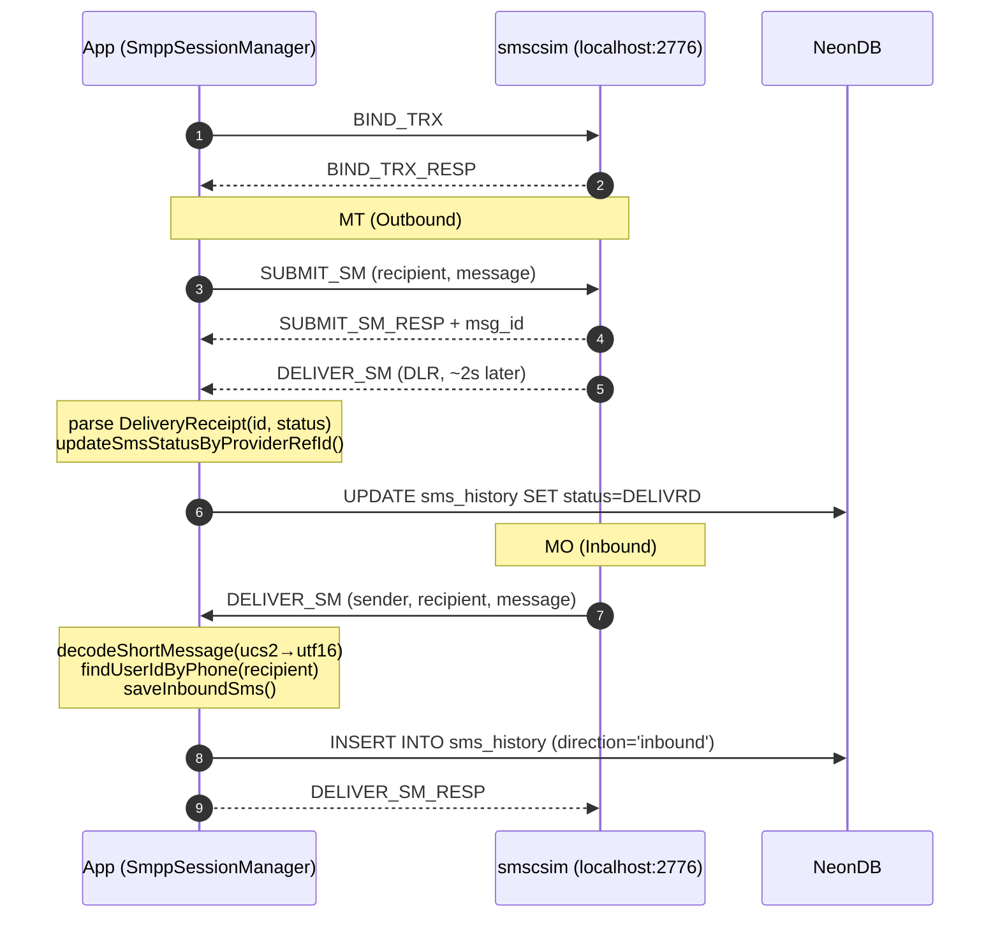
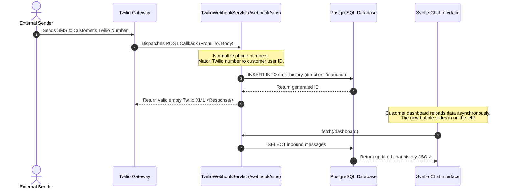

# Twilio-SMS-Client

<p align="center">
  
  
  
  
  
  
  
  
</p>

Dual-provider SMS platform — **Twilio** and **SMPP** with per-user provider routing, real-time internal chat, admin broadcast, and profile-based environment configuration.

## Architecture

```
frontend/                          → Svelte 5 SPA (Vite + Tailwind v4)
src/main/java/.../                 → Jakarta EE 10 servlets (JSON REST)
├── SmppSessionManager             → SMPP session pool (jsmpp)
├── SmppSmsProvider                → SMPP send wrapper
├── SmpEventLogger                 → SMPP event DB logger
├── TwilioSmsProvider              → Twilio REST API wrapper
├── TwilioSmsService               → Twilio for registration (separate creds)
├── SmsRouter                      → Provider dispatch: TWILIO|SMPP|AUTO
├── UserRepository                 → JDBC DAO (HikariCP pool)
├── ChatWebSocket                  → Real-time internal chat (JSR 356)
├── DBUtil                         → HikariCP + Flyway migrations
├── EnvLoader                      → Profile-based env resolution
├── LoginServlet / AuthFilter      → Session auth (BCrypt)
├── RegisterServlet / VerifyMsisdnServlet  → MSISDN verification
├── SendSmsServlet / DeleteSmsServlet      → SMS CRUD
├── DashboardServlet / ProfileServlet      → User data
├── TwilioWebhookServlet           → Inbound SMS callback
├── Admin*Servlet                  → Admin console
├── AdminLogServlet                → GET /admin/smpp-logs
├── WiresharkServlet               → POST/GET /admin/wireshark/*
└── SpaFilter                      → SPA routing fallback
NeonDB                             → PostgreSQL (Flyway V1–V6)
smscsim (Docker)                   → Local SMPP SMSC simulator
```

## Quick Start

### Prerequisites

- Java 21+, Maven, Node 22+
- Podman (or Docker) for SMPP simulator
- PostgreSQL (NeonDB or local)

### Local Dev

```bash
# 1. Start SMPP simulator
podman-compose up -d smscsim

# 2. Configure .env (edit with your DB creds, set APP_PROFILE=local)
cp .env.example .env

# 3. Build frontend
cd frontend && npm install && npm run build && cd ..

# 4. Start server
mvn jetty:run
```

Open http://localhost:8080

### Docker (full stack)

```bash
podman-compose --env-file .env up -d
```

Set `APP_PROFILE=docker` in `.env` for container networking.

### Verification

```bash
# After `mvn jetty:run`, confirm the server is alive:
curl -s http://localhost:8080/login -X POST \
  -H "Content-Type: application/json" \
  -d '{"username":"admin","password":"123456"}'
# Expected: {"status":"success","role":"administrator"}
```

### Test Credentials

| User | Password | Role | Provider |
|------|----------|------|----------|
| `admin` | `123456` | administrator | — |
| `zkhattab` | `kh007` | customer | AUTO (SMPP → localhost:2776) |

## Features

### Customer Dashboard
- **SMS Chat UI** — WhatsApp-style conversation threads grouped by phone number. Dual-tone bubbles: outbound (cyan accent) on right, inbound (emerald accent) on left. Delivery status icons: pending (Check), delivered (CheckCheck green), failed (X red). Delete individual messages. 5-second auto-poll for new messages.
- **New Conversation** — modal to start chat with any phone number (with country code).
- **Profile Settings** — modal with Account Info (name, MSISDN, email, birthday, job, address, password change), Twilio credentials (SID, token, sender ID), and SMS Provider config (TWILIO/SMPP/AUTO selector + SMPP host/port/systemId/password/addressRange).
- **Internal Chat** — real-time user-to-user messaging via WebSocket (`/ws/chat`). User list, conversation history, send/receive with auto-reconnect.
- **System Messages** — tab showing admin broadcasts and system notifications.

### Admin Dashboard
- **Metric Cards** — Active Accounts count, Total Outbound SMS count. Real-time from server.
- **Customer Directory** — searchable table with username, full name, MSISDN, email, job, outbound SMS count, created date. Per-row actions: Edit (full profile modal), SMS (per-customer history modal), Delete (with confirmation).
- **SMS History Modal** — per-customer, chronologically sorted. OUTBOUND/INBOUND colored badges, recipient/sender phone, delivery status, close button.
- **SMPP Logs Modal** — last 500 persistent events from `smpp_event_logs` table. Auto-refresh every 3s. Color-coded by severity (ERROR=red, WARN=yellow, INFO=green). Columns: timestamp, level, event type, detail (truncated at 180 chars).
- **Broadcast Modal** — compose message, optional "send as real SMS" checkbox (routes via each user's configured provider). Shows push count on success.
- **Broadcasts History** — scrollable list of recent broadcast messages with timestamps.
- **Wireshark Capture** — start/stop `dumpcap` from browser. Live packet table via `tshark` polling (2s). Download raw PCAP file.

### Platform
- **Dual SMS Providers** — Twilio + SMPP with per-user routing (TWILIO / SMPP / AUTO). AUTO tries SMPP first, falls back to Twilio.
- **Real-time Internal Chat** — WebSocket between any two users, plus admin broadcast.
- **Profile-Based Environment** — `APP_PROFILE=local|docker` switches SMPP host/port automatically.
- **Flyway Migrations** — versioned, additive-only schema changes on every startup.

## Provider Routing

Each user has a `sms_provider` column: `TWILIO`, `SMPP`, or `AUTO`. Null defaults to `TWILIO`.

- **SMPP** → `SmppSessionManager.submit()` against user's SMPP config (or env fallback)
- **TWILIO** → `TwilioSmsProvider.send()` with user's Twilio creds
- **AUTO** → try SMPP first, fallback to Twilio on failure

## SMPP Development

[ukarim/smscsim](https://github.com/ukarim/smscsim) — local SMSC simulator. Zero auth, accepts any credentials.

| Port | Purpose |
|------|---------|
| 2776 | SMPP (host → container 2775) |
| 12775 | Web UI for MO simulation |

We use a custom image (`localhost/smscsim-fixed`). Upstream had a PDU bug — `service_type` field in DELIVER_SM was `"smscsim"` (7 chars, SMPP max is 5). jsmpp rejects it, so `onAcceptDeliverSm` is never called. Fix: empty service_type.

Rebuild instructions if upstream updates:

```bash
git clone https://github.com/ukarim/smscsim.git /tmp/smscsim
# smsc.go: change 'buf.WriteString("smscsim")' → 'buf.WriteByte(0)'
CGO_ENABLED=0 go build -o smscsim-static .
podman build -t localhost/smscsim-fixed .
```

### SMPP Flow



### DLR (Delivery Receipts)

Returned ~2s after SUBMIT_SM when `registered_delivery=1`. jsmpp `DeliveryReceipt` parser extracts message ID and final status (`DELIVRD`/`UNDELIV`). Status mapped to `message_status` enum and written to `sms_history.provider_ref_id` row.

## Inbound SMS Flow (Twilio)



### Sending MO via Web UI

```bash
curl -X POST http://localhost:12775/ \
  --data-urlencode "sender=+15551234567" \
  --data-urlencode "recipient=+201090702972" \
  --data-urlencode "message=Hello inbound!" \
  --data-urlencode "system_id=smppclient"
```

## Environment

| Variable | Profile | Purpose |
|----------|---------|---------|
| `APP_PROFILE` | both | `local` (host dev) or `docker` (container) |
| `DB_URL` | both | JDBC URL (use `sslmode=require` for NeonDB) |
| `DB_USER` | both | PostgreSQL user |
| `DB_PASSWORD` | both | PostgreSQL password |
| `LOCAL_SMPP_HOST` | local | `localhost` |
| `LOCAL_SMPP_PORT` | local | `2776` |
| `DOCKER_SMPP_HOST` | docker | `smscsim` (container name) |
| `DOCKER_SMPP_PORT` | docker | `2775` (internal container port) |
| `SMPP_SYSTEM_ID` | both | e.g. `smppclient` |
| `SMPP_PASSWORD` | both | e.g. `password` |
| `SMPP_ADDRESS_RANGE` | both | optional source address override |

`EnvLoader` resolves `LOCAL_` or `DOCKER_` prefix based on `APP_PROFILE`.

## Database Migrations (Flyway)

[Flyway](https://flywaydb.org/) is a schema version control tool. On every app startup, `DBUtil.contextInitialized()` obtains a `DataSource` from HikariCP and calls `Flyway.migrate()`. Flyway:

1. Reads the `flyway_schema_history` table in NeonDB (tracks which migrations are already applied + their checksums)
2. Scans migration files in `src/main/resources/db/migration/`, ordered by version number
3. Compares — already-applied migrations are skipped (checksum-verified to detect tampering)
4. Applies any new migrations in sequence
5. Records each successful migration in `flyway_schema_history`

**If a checksum mismatch occurs** (e.g., you edited an already-applied migration), Flyway errors on startup. Fix: create a new migration file instead of editing the old one, or if the old one truly needs replacing: `DELETE FROM flyway_schema_history WHERE version=N;` then restart.

**When to create a migration**: any schema change — add a table, add a column, create an enum. All migrations must be **additive only** (`ADD COLUMN IF NOT EXISTS`, `CREATE TABLE IF NOT EXISTS`). No destructive operations.

| File | Adds |
|------|------|
| `V1__database.sql` (baseline) | `users`, `sms_history`, message_status enum |
| `V2__user_role.sql` | user_role enum, role column |
| `V3__sms_provider.sql` | sms_provider + SMPP columns on users |
| `V4__internal_messages.sql` | Internal chat table |
| `V5__system_message_reads.sql` | Broadcast read tracking |
| `V6__add_smpp_event_logs.sql` | `smpp_event_logs` table |

Naming: `V{next_number}__{short_description}.sql`. Place in `src/main/resources/db/migration/`. `mvn jetty:run` → Flyway executes on startup.

## Security Model

| Layer | Mechanism |
|-------|-----------|
| Password storage | BCrypt (`jbcrypt`) |
| Session auth | HTTP session tracked by `AuthFilter`, cookie-based |
| Admin routes | `AuthFilter` checks `role=administrator`, redirects non-admin |
| Rate limiting | Login: 5 req/min per IP (`LoginServlet`) |
| WebSocket auth | Same HTTP session, validated on upgrade (`ChatWebSocket`) |
| Twilio webhook | Optional `X-Twilio-Signature` validation (if `TWILIO_AUTH_TOKEN` set) |

## Internal Chat

WebSocket at `/ws/chat` (JSR 356) — authenticated via HTTP session. REST fallback at `/api/chat/*` for history. Messages stored in `internal_messages` table. Admin broadcast via `POST /admin/broadcast` sends to all users over WebSocket + optional real SMS.

## Admin Panel

| Feature | Trigger | Backend | Behavior |
|---------|---------|---------|----------|
| Metric Cards | on load | `GET /admin/dashboard` | Active Accounts + Total Outbound SMS counters |
| Customer Table | on load | `GET /admin/dashboard` | All customers with username, MSISDN, email, job, SMS count, created date |
| Edit Customer | Edit button per row | `GET /admin/customer?id=N` → profile modal | Loads full profile, save via `POST /admin/customer` |
| Create Customer | Create Customer button | `POST /admin/customer` | Empty form modal, same save endpoint |
| Delete Customer | Delete button per row | `POST /admin/customer` with `{actionType:delete}` | Confirmation dialog before delete |
| SMS History | SMS button per row | `GET /admin/customer?id=N&action=sms_history` | Modal: outbound + inbound messages sorted by time, colored OUTBOUND/INBOUND badges, status |
| Broadcast | Broadcast button → modal | `POST /admin/broadcast` | Textarea + "send as SMS" checkbox. Returns push count. |
| Broadcasts History | on load | `GET /api/chat/system?limit=100` | Scrollable list of past broadcasts with timestamps |
| SMPP Logs | SMPP Logs button → modal | `GET /admin/smpp-logs` every 3s | Persistent DB logs, color-coded (ERROR=red, WARN=yellow, INFO=green), timestamp/event/detail columns |
| Wireshark Capture | Wireshark button → modal | `POST/GET /admin/wireshark/*` | Start/stop `dumpcap`, live packet table via `tshark` (2s poll), PCAP download |

## Customer Dashboard

| Feature | Location | Backend | Behavior |
|---------|----------|---------|----------|
| SMS Chat | SMS tab (default) | `GET /dashboard` every 5s | Conversation sidebar + message thread. Dual-tone bubbles with status icons. Send via `POST /send-sms`. |
| New Conversation | New Chat button → modal | — | Enter phone number → creates thread |
| Delete Message | Trash icon per bubble | `POST /delete-sms` | Confirmation dialog |
| Profile Settings | Edit Profile button → modal | `GET /profile` + `POST /profile` | Account Info, Twilio creds, SMS Provider config |
| Internal Chat | Internal tab | WebSocket `/ws/chat` + `GET /api/chat/*` | Real-time user-to-user. User list, message history, send. Auto-reconnect. |
| System Messages | System tab | `GET /api/chat/system` | Admin broadcasts and system notifications |

## API Endpoints

| Method | Path | Auth | Purpose |
|--------|------|------|---------|
| POST | `/login` | none | Session login (BCrypt, 5/min rate limit) |
| POST | `/logout` | none | Destroy session |
| POST | `/register` | none | Create account, send PIN via Twilio |
| POST | `/verify-msisdn` | none | Confirm phone via 6-digit PIN |
| GET | `/dashboard` | session | Profile + SMS history by conversation |
| POST | `/send-sms` | session | Send SMS (routed by sms_provider) |
| POST | `/delete-sms` | session | Delete SMS by id |
| GET/POST | `/profile` | session | View/update profile, change password |
| GET | `/admin/dashboard` | admin | Customer list + SMS stats |
| GET/POST | `/admin/customer` | admin | List/create/update customers |
| POST | `/admin/broadcast` | admin | Broadcast SMS to all customers |
| GET | `/api/chat/*` | session | Internal chat message history |
| WS | `/ws/chat` | session | Real-time internal chat |
| POST | `/webhook/sms` | none | Twilio inbound webhook callback |

## Per-User Provider Config

Database columns on `users` table (added by Flyway V4):

| Column | Example |
|--------|---------|
| `sms_provider` | `TWILIO`, `SMPP`, `AUTO`, or `NULL` (defaults to TWILIO) |
| `smpp_host` | `127.0.0.1` |
| `smpp_port` | `2776` |
| `smpp_system_id` | `smppclient` |
| `smpp_password` | `password` |
| `smpp_source_addr` | optional override |
| `twilio_account_sid` | `AC...` |
| `twilio_auth_token` | `...` |
| `twilio_sender_id` | `+13613221215` |

## FAQ

**Q: Jetty starts but browser shows blank page or 404.**
A: You forgot to build the frontend. Run `cd frontend && npm install && npm run build && cd ..` then restart Jetty.

**Q: SMS sends but DLR never arrives (SMPP).**
A: smscsim container not running or wrong port. Check `podman ps | grep smscsim`. Default port is 2776 (host) → 2775 (container).

**Q: MO (inbound SMS) not appearing in DB.**
A: User's `msisdn` is NULL in the `users` table. Run `UPDATE users SET msisdn='+1234567890' WHERE id=N;` and try again.

**Q: SLF4J warnings about NOP logger on startup.**
A: Harmless. Jetty Maven Plugin isolates webapp classloader; `logback-classic` falls back to NOP. We use `slf4j-simple` — the warnings can be ignored.

**Q: Registration via `/register` fails with "Gateway execution error".**
A: Registration requires real Twilio credentials (sends a PIN SMS). Without them, it fails gracefully. Use the admin panel to create accounts instead.

**Q: Jetty kill command?**
A: `ps aux | grep "jetty:run" | awk '{print $2}' | xargs kill` — never use `lsof -ti:8080` (kills Firefox viewing the app).

## Project Structure

```
├── docker-compose.yml        # smscsim + app services
├── Dockerfile                # Multi-stage (Node 22 → Maven 21 → Jetty Runner)
├── database.sql              # V1 baseline schema (Flyway)
├── pom.xml                   # Jakarta 10, HikariCP, jsmpp, Flyway, jbcrypt
├── mvnw                      # Maven wrapper
├── frontend/
│   ├── src/lib/              # Svelte components
│   └── vite.config.js        # Build output → ../src/main/webapp/
├── src/main/
│   ├── java/.../twilio_project/   # Servlets, providers, DAO, utils
│   ├── resources/db/migration/    # Flyway V2–V6
│   └── webapp/               # Vite build target (static assets)
├── .env.example              # Template (safe to commit)
├── .env.local                # Local creds (gitignored)
├── .env.docker               # Docker-specific creds (gitignored)
└── .gitignore
```
