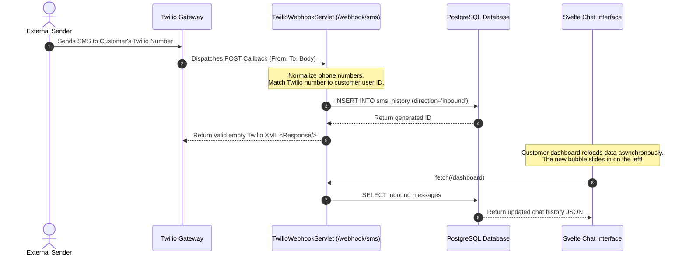

<div align="center">
  
  <!-- Visual Branding Header -->
  <p align="center">
    
  </p>

  # 📱 SOTA Twilio SMS Client & Messaging Console

  <p align="center">
    <strong>An elite, high-performance Customer Engagement & Administration Platform.</strong><br/>
    Restructured from server-side JSP rendering to a reactive <strong>Svelte 5 Single Page Application (SPA)</strong>, styled with <strong>Tailwind CSS v4.0</strong>, and backed by a secure <strong>Java Servlet JSON REST API</strong>.
  </p>

  <!-- Shields.io Badges -->
  <p align="center">
    
    
    
    
    
    
  </p>

  <p align="center">
    <a href="#-project-concept">Project Concept</a> • 
    <a href="#-features--uiux-walkthrough">UI/UX Showcases</a> • 
    <a href="#-system-architecture">Architecture</a> • 
    <a href="#-database-schema--setup">Database Setup</a> • 
    <a href="#-installation--running-guide">Installation Manual</a> • 
    <a href="#-rest-api-endpoint-reference">API Docs</a>
  </p>

</div>

---

## 💡 Project Concept & Value Proposition

Traditional SMS portals often rely on legacy server-side page refreshes, resulting in high latency, clunky interfaces, and poor responsiveness. 

This project completely restructures the **Twilio SMS Client** into a highly decoupled, state-of-the-art platform:
1.  **Serverless-like Reactivity (Svelte 5):** The client runs entirely inside the user's browser as a Single Page Application. It uses Svelte's compile-time **Runes** for precise DOM updates without Virtual DOM overhead.
2.  **Stateless REST Core (Java Servlets):** The Java backend is refactored from rendering JSPs to acting as a high-performance **JSON REST API**, utilizing **HikariCP** connection pooling, **BCrypt** security, and **Gson** parsing.
3.  **Chat-Centric Messaging:** Outgoing and inbound SMS histories are grouped by phone number into an interactive **Real-Time SMS Chat Interface** (WhatsApp/iMessage style), completely replacing basic tables.

---

## ✨ Features & UI/UX Walkthrough

### 💬 Interactive SMS Chat Interface (Customer View)
*   **Conversation Threads:** Automatically merges outbound messages and inbound callbacks into a single continuous thread based on contact phone number.
*   **Dual-Tone Bubble Accents:** 
    *   *Outbound (Right):* Glowing gradient bubbles (`Cyan-to-Emerald`) with checkmarks representing Twilio status ticks (Delivered, Pending, Failed).
    *   *Inbound (Left):* Low-opacity glassmorphic gray/sage bubbles displaying received SMS.
*   **Real-time Animations:** Svelte's native `fade` and `slide` transitions animate chat bubbles instantly upon sending.

### 🛡️ Administrative Control Panel (Admin View)
*   **Customer Directory:** List all customer accounts, view complete profiles, create new customers, or delete accounts directly.
*   **Statistical Counters:** Interactive analytics cards displaying real-time platform metrics (Total Active Customers, Grand Total SMS Sent).
*   **SMS Sent Aggregation:** Displays SMS volume metrics for each customer in high-precision progress meters.

### 🔏 Secure MSISDN Verification
*   **Double-Credential Registration:** Customers enter profile data and Twilio API credentials (SID, Auth Token, Sender ID).
*   **PIN Code Validation:** Sends a 6-digit random code to the user's phone via their own Twilio credentials. The account is only activated upon entering the correct code.

---

## 🏛️ System Architecture & Data Flows

### Decoupled Directory Structure
```text
Twilio-SMS-Client/
├── frontend/                     # Node.js Svelte SPA (Tailwind v4.0, Vite 8)
│   ├── src/
│   │   ├── lib/                  # Reactive views (Login, Chat Dashboard, Admin Dashboard)
│   │   ├── App.svelte            # Root shell & SPA routing coordinator
│   │   └── app.css               # Glassmorphism design system styles
│   └── vite.config.js            # Directs build output straight to ../src/main/webapp/
├── src/main/
│   ├── java/com/twilio/twilio_project/
│   │   ├── UserRepository.java   # Data Access Object (JDBC Queries)
│   │   ├── AuthFilter.java       # Jakarta Filter securing /admin/* endpoints
│   │   ├── LoginServlet.java     # Refactored JSON Auth endpoint
│   │   ├── DashboardServlet.java # Packs profile & chat threads as JSON
│   │   └── ... (Existing Servlet controllers converted to REST)
│   └── webapp/                   # Vite Production Target (HTML, JS, CSS assets served here)
├── database.sql                  # PostgreSQL Schema file
└── pom.xml                       # Maven config (Imports HikariCP, Gson, PostgreSQL, jbcrypt)
```

### Inbound SMS Webhook callback Flow
Exposing `/webhook/sms` allows Twilio to feed incoming messages directly into our platform:



---

## 💾 Database Schema & Setup

The database layer runs on **PostgreSQL** and uses advanced enums, custom triggers, and optimization indexes:

```sql
-- Enums for role division and message statuses
CREATE TYPE user_role AS ENUM ('customer', 'administrator');
CREATE TYPE message_status AS ENUM ('pending', 'delivered', 'failed');
CREATE TYPE sms_direction AS ENUM ('inbound', 'outbound');

-- Core Users Table
CREATE TABLE users (
    id SERIAL PRIMARY KEY,
    username VARCHAR(50) UNIQUE NOT NULL,
    password_hash VARCHAR(255) NOT NULL,
    role user_role NOT NULL DEFAULT 'customer',
    full_name VARCHAR(100),
    birthday DATE,
    msisdn VARCHAR(20) UNIQUE,
    job VARCHAR(100),
    email VARCHAR(255) UNIQUE,
    address TEXT,
    twilio_account_sid VARCHAR(34),
    twilio_auth_token VARCHAR(255),
    twilio_sender_id VARCHAR(34),
    msisdn_validated BOOLEAN NOT NULL DEFAULT FALSE,
    created_at TIMESTAMP NOT NULL DEFAULT CURRENT_TIMESTAMP,
    updated_at TIMESTAMP NOT NULL DEFAULT CURRENT_TIMESTAMP
);

-- SMS History Table (with direction attribute support)
CREATE TABLE sms_history (
    id SERIAL PRIMARY KEY,
    user_id INTEGER NOT NULL REFERENCES users(id) ON DELETE CASCADE,
    from_phone VARCHAR(20) NOT NULL,
    to_phone VARCHAR(20) NOT NULL,
    message TEXT NOT NULL,
    status message_status NOT NULL DEFAULT 'pending',
    direction sms_direction NOT NULL DEFAULT 'outbound',
    sent_at TIMESTAMP NOT NULL DEFAULT CURRENT_TIMESTAMP
);

-- Optimization Indexes
CREATE INDEX idx_users_role ON users(role);
CREATE INDEX idx_users_msisdn ON users(msisdn);
CREATE INDEX idx_sms_history_user_id ON sms_history(user_id);
```

### Database Initialization Instructions:
1.  Launch your PostgreSQL console:
    ```bash
    psql -U postgres
    ```
2.  Create the Twilio SMS Database:
    ```sql
    CREATE DATABASE twilio_sms_db;
    \c twilio_sms_db;
    ```
3.  Run the schema setup query:
    ```bash
    psql -U postgres -d twilio_sms_db -f database.sql
    ```

---

## ⚙️ Installation & Running Guide

Follow these exact steps to compile, configure, and launch the Svelte SPA + Java REST application:

### 1. Configure the Local Environment Variables
Create a file named **`.env`** in the root directory (copying `.env.example` as a template):
```env
DB_URL=jdbc:postgresql://localhost:5432/twilio_sms_db
DB_USER=your_postgres_username
DB_PASSWORD=your_postgres_password
```
*Note: Make sure your local PostgreSQL server is active and running.*

### 2. Frontend Svelte Compilation
Vite compiles your frontend and bundles it straight into the backend servlet container:
```bash
# Navigate to the frontend directory
cd frontend

# Install Node modules & dependencies
npm install

# Compile the production bundle
npm run build
```
The compiler minifies all Svelte and Tailwind v4.0 elements and copies them directly into `src/main/webapp/`, overwriting legacy JSPs.

### 3. Backend Compilation & Server Boot
Return to the root directory and use the Maven Wrapper to compile and boot your Jetty container:
```bash
# Return to root
cd ..

# Compile Java classes and boot the Jetty web container
mvn clean compile jetty:run
```

Once the terminal logs indicate the server is active, open:
👉 **`http://localhost:8080/`** to view your beautiful new dark-glassmorphic messaging platform!

---

## 🔀 REST API Endpoint Reference

All communication between the Svelte client and the Java backend is handled via standard JSON payloads.

| HTTP Method | Request Endpoint | Required Headers | JSON Payload / Request Params | Response Schema (JSON) |
| :--- | :--- | :---: | :--- | :--- |
| **POST** | `/login` | `application/json` | `{ "username": "ziad", "password": "123" }` | `{ "status": "success", "role": "customer" }` |
| **POST** | `/register` | `application/json` | `{ "username": "...", "fullName": "...", ... }` | `{ "status": "success", "message": "Code sent" }` |
| **POST** | `/verify-msisdn` | `application/json` | `{ "code": "123456" }` | `{ "status": "success" }` |
| **GET** | `/dashboard` | Cookie Session | *None* | `{ "profile": {...}, "outboundHistory": [...], "inboundHistory": [...] }` |
| **POST** | `/send-sms` | `application/json` | `{ "recipient": "+12345", "message": "Hi" }` | `{ "status": "success", "status": "delivered" }` |
| **POST** | `/delete-sms` | `application/json` | `{ "smsId": 12 }` | `{ "status": "success" }` |
| **GET** | `/admin/dashboard`| Cookie Session | *Admin verification enforced* | `{ "totalCustomers": 10, "customers": [...], "stats": [...] }` |
| **POST** | `/admin/customer` | `application/json` | `{ "username": "...", "fullName": "...", ... }` | `{ "status": "success" }` |
| **POST** | `/webhook/sms` | `url-encoded` | `From=+123&To=+456&Body=Hello` | `<Response></Response>` (Twilio XML) |

---

## 🤝 Collaborative Contribution Policy
This project stands on the shoulders of the original, high-quality commits contributed by teammates **Mahmoud Osama** and **Mohamed Abdulnaby**. 

Their historical commits are **100% preserved and respected** inside the Git commit logs. All Svelte SPA integrations and REST refactorings are created as new commits stacked directly on top of their core database schema, security libraries, and registration routing configurations.
