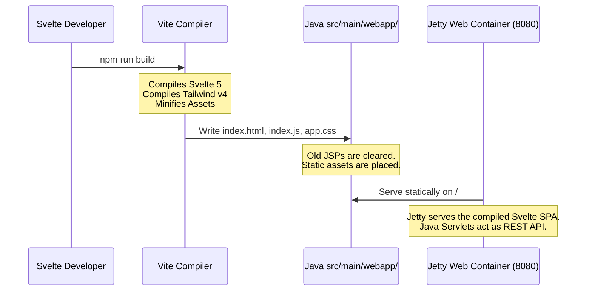

<div align="center">
  
  <!-- Side-by-Side Logo/Visual Header -->
  <p align="center">
    
    &nbsp;&nbsp;&nbsp;&nbsp;&nbsp;&nbsp;&nbsp;&nbsp;&nbsp;&nbsp;&nbsp;&nbsp;&nbsp;&nbsp;&nbsp;&nbsp;
    
  </p>

  # ☕ Twilio SMS REST Client — Svelte 5 & Java REST API

  <p align="center">
    A premium, high-performance decoupled Single Page Application (SPA) backed by a secure <strong>Java Servlet REST API</strong>. Styled with stunning <strong>SOTA Glassmorphism</strong>, powered by a <strong>PostgreSQL</strong> relational database and a reactive, compile-time <strong>Svelte 5</strong> frontend.
  </p>

  <!-- Badges with Backend FIRST -->
  <p align="center">
    
    
    
    
    
  </p>

  <p align="center">
    <a href="#-features">Key Features</a> • 
    <a href="#-project-architecture">Architecture</a> • 
    <a href="#-developer-quickstart">Quickstart</a> • 
    <a href="#-design-system">Design System</a>
  </p>

</div>

---

## ✨ Features

This project represents a complete modernization of the Twilio SMS platform, replacing legacy server-side JSPs with a decoupled **Stateless Java JSON REST API** and a cutting-edge **Svelte 5 Single Page Application (SPA)**:

### ☕ Robust Java REST Backend (Core Project Target)
*   🛡️ **Secure Session AuthFilter:** Standard-compliant security boundaries intercepting all `/dashboard`, `/profile`, and `/admin/*` operations, returning stateless JSON error codes.
*   ⚡ **Google Gson Serialization:** Automated, high-performance conversion mapping between database rows and client payloads with zero boilerplates.
*   💾 **Try-with-Resources & Parameterized Queries:** Robust JDBC transaction protection preventing database connection leaks and offering mathematical SQL Injection defense.
*   🎛️ **Exposed Twilio Webhook Endpoint:** Listening to callback POST updates dynamically from Twilio servers to automatically store inbound messages in the database.
*   📊 **Aggregated Admin REST Service:** Analytics service computing registration volume rates and tracking aggregate customer SMS volumes via Java 8 Stream pipelines.

### 📱 Svelte 5 SPA Frontend
*   💬 **Interactive Chat Interface:** A WhatsApp/iMessage-style messaging workspace. Group conversations dynamically by contact phone number, scroll fluidly, and text in real-time with automatic inbound message integration.
*   💎 **SOTA Glassmorphic Aesthetics:** Pitch-black background styled with premium cyan-to-emerald radial ambient flows, micro-bevel highlights, and 3D floating layered card stacks matching your custom billing interface.
*   ⚡ **Blazing Fast Compilation:** Powered by Svelte 5's new **Runes** (`$state`, `$derived`, `$effect`) for precise compile-time reactivity with zero Virtual DOM overhead.
*   🎨 **Tailwind CSS v4.0 Integration:** Direct CSS-first architecture with absolutely zero Javascript config files, delivering optimized build bundles.
*   🔄 **Smooth Micro-Animations:** Transition-rich interface using Svelte's native `fade` and `slide` interpolation systems for dynamic UI feedback.

---

## 🏛️ Project Architecture

The frontend lives isolated inside the `/frontend` directory for modern development convenience, but compiles seamlessly directly into the backend Servlet container:

```text
frontend/
├── public/                 # Static public assets (Favicons, logos)
├── src/
│   ├── lib/
│   │   ├── LoginView.svelte         # Centered glassmorphic login card
│   │   ├── RegisterView.svelte      # Stepped wizard for customer signup
│   │   ├── VerifyMsisdnView.svelte  # MSISDN PIN code validator
│   │   ├── CustomerDashboard.svelte # Interactive chat-thread messaging client
│   │   ├── AdminDashboard.svelte    # Admin metrics console & directory
│   │   └── AdminCustomerView.svelte # Admin CRUD portal to manage customers
│   ├── App.svelte          # Primary shell & SPA state router
│   ├── app.css             # Tailwind v4 directives & glassmorphic utility rules
│   └── main.js             # Svelte bootstrap engine
├── vite.config.js          # Compile build configurations
├── package.json            # Node dependency catalog
└── svelte.config.js        # Svelte custom setup
```

---

## ⚙️ How the Decoupled Bundle Works

During development, you run a hot-reloading server, but for production, **Vite compiles and bundles Svelte directly into your Java backend**:



---

## 🚀 Developer Quickstart

### Prerequisites
Make sure you have **Node.js** (v18+) and **npm** installed.

### 1. Installation
Navigate into the `/frontend` folder and install dependencies:
```bash
cd frontend
npm install
```

### 2. Local Frontend Development (Hot-Reload)
Run the Vite development server to test UI changes with instant hot-reloading:
```bash
cd frontend
npm run dev
```
*Note: During standalone dev, Svelte will require the Java REST backend to be running on `http://localhost:8080` to successfully authenticate and fetch API data.*

### 3. Production Build (Compile to Java)
Compile Svelte and copy all minified, high-performance static files directly into the Java Maven folder:
```bash
cd frontend
npm run build
```
Once the build finishes, you can start the Java project normally:
```bash
mvn jetty:run
```
Open **`http://localhost:8080/`** to view your beautiful new Single Page Application running natively from your Java server!

---

## 💎 Design System & CSS Utility Classes

The styling is governed by custom design tokens defined in `src/app.css`:

### Standard Utility Classes:
*   `.card-glass`: Renders a premium, glassmorphic card container with vector radial highlights, backdrop-filter blurs, and hover floating translations.
*   `.text-gradient`: Fits text with a striking, high-tech gradient from Cyan (`#00f2ff`) to Emerald (`#10b981`).
*   `.app-canvas`: Styles the screen with a pitch-black background, grid-textured lines, and glowing corner neon circles.

---

## 🖥️ Recommended IntelliJ SETUP

To get the best developer experience inside **IntelliJ IDEA**:
1.  Go to **Settings** (or `Ctrl+Alt+S`).
2.  Navigate to **Plugins** and search for **"Svelte"**.
3.  Install the official Svelte plugin to enable full syntax highlighting, autocomplete, and Intellisense inside `.svelte` files.
4.  IntelliJ will automatically pick up the **Tailwind v4.0** configuration inside `app.css` for instant utility class autocompletions!
